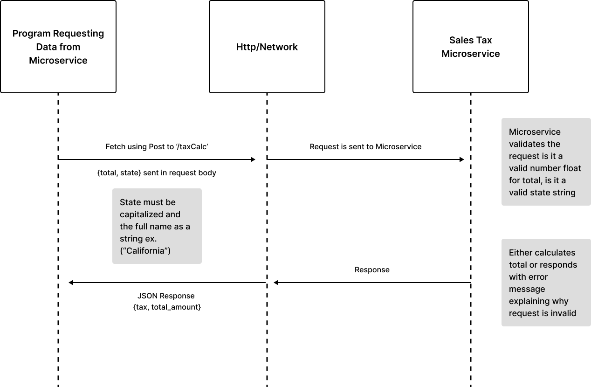

# MicroserviceA_SalesTaxCalc
    
    Microservice A: A backend service that when provided with the total cost of an item and a state, returns the total cost with tax on the dollar amount of the tax.
    
    Expect this response, variables are defined exactly as written below:
   
    - tax: calculated tax
    - total_cost: total cost

# Communication Contract:

    I will not change any of my code the endpoint and ways to both request and receive data will remain unchanged.

# How to Request Data from Microservice

    - because you are using react maybe you will be using fetch in your frontend 
    within a component 
   
    -within your component you will write a fetch request and within the fetch request use your useState set function to set the result or total to then display it to the user
    
    - the type of request is POST and it should be sent to local host 
    - endpoint route is '/taxCalc'
    
    - JSON request pody of the post request must have total: float, and state:,  
       
       * valid state 'string' with first letter capitalized no other capitals *

    
    ----------Example of Requesting Data from Microservice----------

    
    --------- Define Data to send in request body ------------------
    
    const order = {
        total: 250.00,
        state: "Arizona"
    }
    --------- Request ---------------------------------------------
   
    const response = await fetch('http://localhost:3000/taxCalc', {
        method: 'POST',
        headers: {
            'Content-Type': 'application/json'
        },
        body: JSON.stringify(order)
    })

    -----------------------------------------------------------------

# How to Receive Data from Microservice 

    - you will call .json on your response variable as it is the 
    object you receive from the microservice

    --------- Receiving Data back from Microservice------------------

    const result = await response.json()

    - Result is two values the first being tax amount ( tax ) and the second is the 
    total ( total_cost ) to get just one or the other 

    console.log(result.tax)
    console.log(result.total_cost)

    console.log("Here is the tax amount and total cost:", result)

    In react you could use 
        
        const[tax, setTax] = useState(null)
        const[totalCost, setTotalCost] = useState(null)

# UML Diagram:

